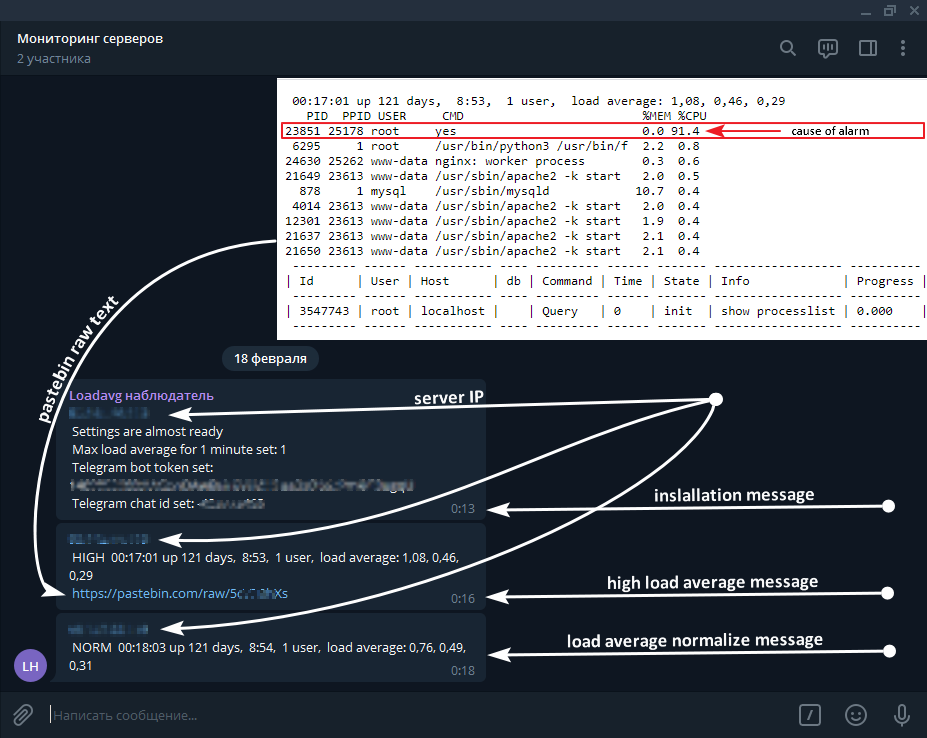

# loadavg-telegram-watcher
monitors the load average server and in case of problems sends problem messages to Telegram, sends paste to pastebin.com with info of user processes sorted by cpu usage and current processlist mysql. Pastebin link is included in the telegram message.

easy install with customization:

\# bash <(curl -s https://raw.githubusercontent.com/avtobys/loadavg-telegram-watcher/main/install.sh)  

the script will ask for missing variables:  

\# AVG_MAX="3"; \  
BOT_ID="your_telegram_bot_token"; \  
CHAT_ID="your_chat_id"; \  
PASTE_KEY="your_paste_key"; \  
bash <(curl -s https://raw.githubusercontent.com/avtobys/loadavg-telegram-watcher/main/install.sh)

automatic places this script to /usr/local/bin/loadavg_watcher  
automatic places places the cron task to /etc/cron.d/loadavg_watcher

complete!

* Tested on Debian Linux

load 1 processor by 100%  
\# yes > /dev/null

